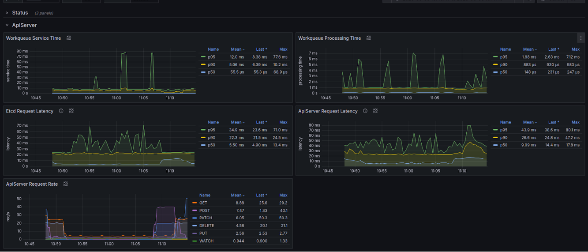
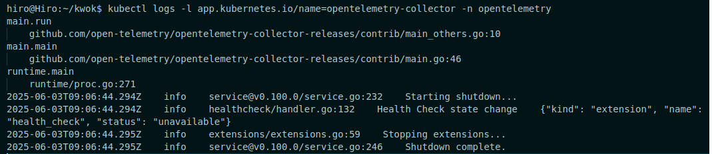

# Setup EKS and OpenTelemetry

1. Create EKS and add two nodes

2. Setup kwok using helm on the EKS
```helm repo add kwok https://kwok.sigs.k8s.io/charts/```
```helm repo update```
```helm upgrade --install kwok kwok/kwok --namespace kube-system --create-namespace```
```helm repo update```

3. Install policy chart - stage-fast. It is required to deploy many replicas to the kwok, not the k8s itself.
```helm upgrade --install stage-fast kwok/stage-fast --namespace kube-system```

4. Install OpenTelemetry on the EKS
```helm repo add open-telemetry https://open-telemetry.github.io/opentelemetry-helm-charts```
```helm repo update```

```helm upgrade otel-collector open-telemetry/opentelemetry-collector --namespace opentelemetry -f otel-values.yaml```

5. Install Prometheus and Grafana
```helm repo add prometheus-community https://prometheus-community.github.io/helm-charts```
```helm repo update```
```helm install monitoring prometheus-community/kube-prometheus-stack --namespace monitoring --create-namespace```

PROBLEMS
Despite that the application was running properly:


problem occured when dealing with OpenTelemetry:


hiro@Hiro:~/kwok$ kubectl logs -l app.kubernetes.io/name=opentelemetry-collector -n opentelemetry
main.run
    github.com/open-telemetry/opentelemetry-collector-releases/contrib/main_others.go:10
main.main
    github.com/open-telemetry/opentelemetry-collector-releases/contrib/main.go:46
runtime.main
    runtime/proc.go:271
2025-06-03T09:06:44.294Z    info    service@v0.100.0/service.go:232    Starting shutdown...
2025-06-03T09:06:44.294Z    info    healthcheck/handler.go:132    Health Check state change    {"kind": "extension", "name": "health_check", "status": "unavailable"}
2025-06-03T09:06:44.295Z    info    extensions/extensions.go:59    Stopping extensions...
2025-06-03T09:06:44.295Z    info    service@v0.100.0/service.go:246    Shutdown complete.


Also problem with running stage-fast, because deployment was still runing at k8s not kwok.

