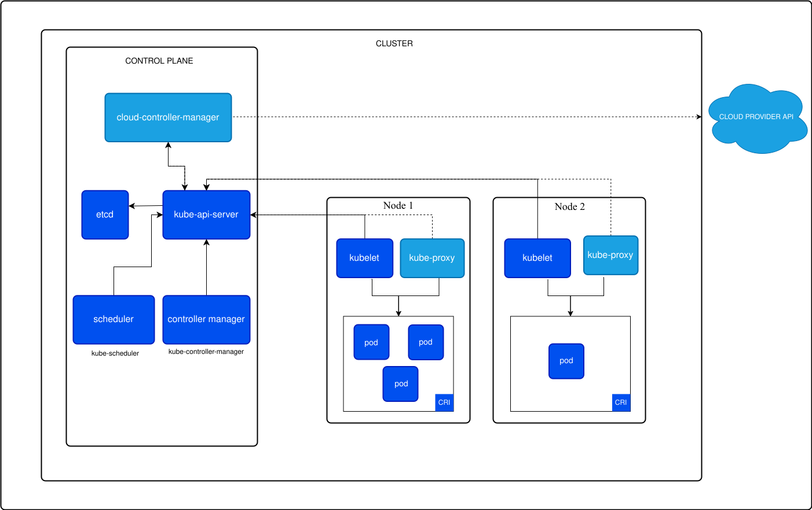

# Theoretical Background

The successful execution of this project relies on a synergistic combination of technologies that enable the simulation of large-scale Kubernetes environments and the implementation of a comprehensive observability stack. This section details the core components of this technology stack, outlining their functionalities and their specific relevance to addressing the challenges of observability in extensive Kubernetes deployments.

## Kubernetes

Kubernetes is an open-source container orchestration platform designed to automate the deployment, scaling, and management of containerized applications. It has emerged as a de facto standard for cloud-native applications, providing robust abstractions that decouple applications from the underlying infrastructure. This allows for the creation and management of complex, distributed systems without direct interaction with individual physical or virtual machines. Below we present a diagram of kubernetes architecture.

### Key Architectural Components

#### Control Plane
The brain of the Kubernetes cluster, making global decisions about the cluster and detecting and responding to cluster events. Key components include:

- **API Server (kube-apiserver)**: Exposes the Kubernetes API, acting as the frontend for the Kubernetes control plane. It processes REST requests, validates them, and updates the corresponding objects in etcd.
- **etcd**: A consistent and highly-available key-value store used as Kubernetes' backing store for all cluster data. All state information, configurations, and specifications of the cluster resources are stored here. The performance and reliability of etcd are critical for the overall cluster health, especially in large-scale deployments.
- **Scheduler (kube-scheduler)**: Watches for newly created Pods that have no Node assigned and selects a Node for them to run on based on resource availability, constraints, and other policies.
- **Controller Manager (kube-controller-manager)**: Runs controller processes. These controllers watch the state of the cluster through the API Server and make changes attempting to move the current state towards the desired state. Examples include the Node controller, Replication controller, etc.

#### Worker Nodes
These machines run the containerized applications. Each worker node hosts:
- **Kubelet**: An agent that runs on each node in the cluster. It ensures that containers are running in a Pod as specified by the control plane. It manages the lifecycle of pods and their containers, reporting back to the control plane on their status. The Kubelet's interaction with the container runtime (like Docker or containerd) and its constant reporting contribute significantly to the telemetry data generated within a cluster.

In the context of this project, understanding Kubernetes architecture is crucial because the sheer volume of components (thousands of nodes, tens of thousands of pods) in large-scale deployments generates an immense amount of telemetry data (logs, metrics, traces). Effectively managing and observing this data flow is paramount for maintaining cluster health, performance, and reliability, yet it presents significant challenges for traditional monitoring tools.

## KWOK

KWOK, which stands for Kubernetes WithOut Kubelet, is an innovative toolkit designed to simulate Kubernetes node and pod lifecycles without the need to run actual Kubelet processes or container runtimes on the simulated nodes. This approach allows for the creation of thousands of virtual nodes and pods with minimal resource consumption (CPU, memory) on the machine running the simulation.

### Key Features

- **Scalable Simulation**: KWOK enables the simulation of large-scale Kubernetes clusters that would otherwise be resource-prohibitive or expensive to create using actual virtual machines or physical hardware. This is critical for testing the scalability and performance of observability solutions under realistic load conditions.
- **Control Plane Focus**: By abstracting away the Kubelet and the actual workload execution, KWOK allows testing to focus on the behavior and performance of the Kubernetes control plane components, particularly the API server and etcd, under high load from a large number of simulated nodes and pods reporting their status.
- **Cost-Effectiveness**: It provides a low-cost method to replicate production-like environments for testing and validation of cluster management tools and observability stacks.
- **Realistic Telemetry Generation**: While KWOK doesn't run actual application workloads, it can be configured to simulate the state changes and heartbeats that nodes and pods would typically generate. For this project, this simulated telemetry (or the telemetry from lightweight agents deployed alongside KWOK-managed objects) will serve as the high-volume data source to test the observability pipeline.

KWOK is primarily used for testing the Kubernetes control plane, including its data store, etcd. However, its utility extends to simulating the appearance of a large, active cluster, making it an ideal tool for this project's goal of evaluating observability stacks at scale.

## Observability Tools

A modern observability stack typically comprises tools for data collection, processing, storage, and visualization. For this project, we will leverage OpenTelemetry for standardized telemetry data collection and Grafana for visualization, with the understanding that suitable backend systems will be chosen for storing metrics, logs, and traces.

### OpenTelemetry

OpenTelemetry is an open-source observability framework, a graduated project of the Cloud Native Computing Foundation (CNCF), that provides a unified set of APIs, SDKs, libraries, and tools for instrumenting applications and infrastructure to generate, collect, process, and export telemetry data (metrics, logs, and traces).

#### Key Aspects

 + **Vendor-Neutral Standardization**: It offers a single, vendor-agnostic standard, preventing vendor lock-in and allowing for flexibility in choosing backend analysis tools.
 + **Comprehensive Data Collection**: OpenTelemetry supports the "three pillars of observability":
   + **Metrics**: Numerical measurements of system behavior over time (e.g., CPU utilization, request latency, error rates).
   + **Logs**: Timestamped records of events occurring within applications or systems.
   + **Traces**: Records of the path of a request as it travels through the various components of a distributed system, providing insights into latency and dependencies.
 + **Components**: 
   + **APIs**: Define how telemetry data is generated.
   + **SDKs**: Language-specific implementations of the APIs.
   + **Collector (OpenTelemetry Collector)**: A flexible and powerful component that can receive telemetry data from various sources, process it (e.g., filter, batch, enrich), and export it to one or more backend systems. The Collector will be a key element in our stack for managing the flow of data from the simulated Kubernetes environment.
 + **Ecosystem and Integration**: OpenTelemetry integrates with a wide range of popular observability backends, analysis tools, and instrumentation libraries, facilitating its adoption in diverse environments.

In this project, OpenTelemetry will be crucial for instrumenting the simulated environment (or agents within it) to generate telemetry and for configuring the collection pipeline to efficiently gather and forward this data to the chosen storage backends. Its ability to handle high volumes of data and its configurable nature will be tested.

### Grafana

Grafana is a leading open-source platform for interactive data visualization, monitoring, and analysis. It allows users to query, visualize, alert on, and understand their metrics, logs, and traces, regardless of where they are stored.

#### Key Features

- **Versatile Data Source Support**: Grafana supports a multitude of data sources, including popular time-series databases (e.g., Prometheus, InfluxDB), logging systems (e.g., Loki, Elasticsearch), and tracing systems (e.g., Jaeger, Zipkin). This flexibility allows it to serve as a unified visualization layer for the diverse telemetry data collected.
- **Rich Visualization Options**: It offers a wide array of visualization options, from simple graphs and charts to complex dashboards, enabling the creation of insightful views into system performance and health.
- **Dashboarding and Sharing**: Users can create dynamic and reusable dashboards that can be shared with team members, facilitating collaborative monitoring and troubleshooting.
- **Alerting**: Grafana includes a robust alerting system that can notify users of issues based on defined thresholds or patterns in the data.
- **Scalability and Performance**: While Grafana itself is a visualization tool, its performance when querying and rendering data from large datasets will be a key aspect of the evaluation in this project, especially concerning dashboard load times and query latency under high-cardinality conditions.

Grafana will serve as the primary interface for observing and analyzing the behavior of the observability stack under the load generated by the KWOK-simulated environment. Its ability to handle queries over large time ranges and high-cardinality data from the scaled simulation will be a critical point of assessment.

By integrating KWOK for scalable environment simulation with a robust observability stack based on OpenTelemetry for data collection and Grafana for visualization (along with appropriate backends), this project aims to provide a comprehensive evaluation of observability strategies in large-scale Kubernetes deployments.