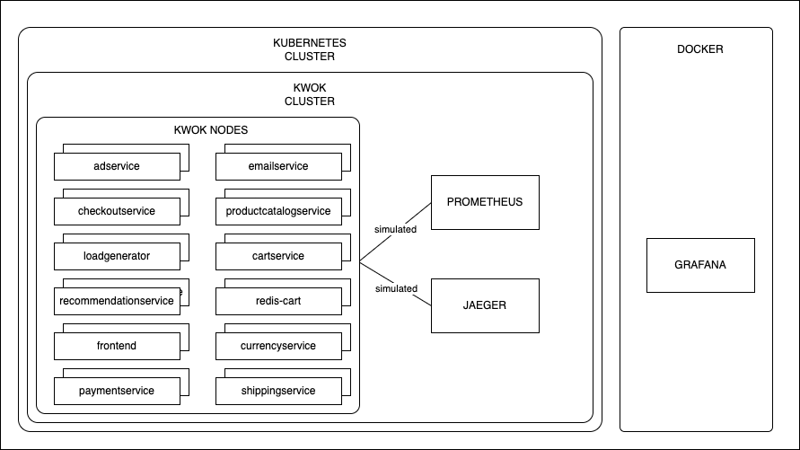
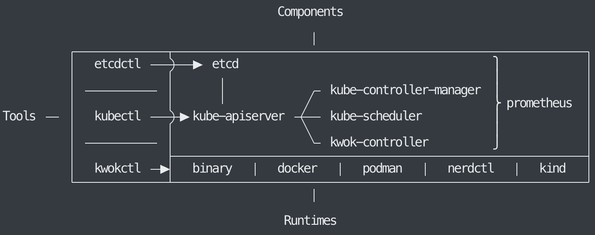

# Solution Architecture

## Solution Architecture Diagram

## KWOK Architecture Diagram

## Online Boutique Architecture Diagram

## Architecture Components

### etcd

A consistent and highly-available key-value store used as Kubernetes' backing store for all cluster data. etcdctl is a command-line client for etcd.

### kube-apiserver

The frontend for the Kubernetes control plane. It exposes the Kubernetes API, which is used by other components and tools to communicate with the cluster.

### kube-controller-manager

Runs controller processes. Controllers are background threads that run tasks in a cluster. Examples include the node controller, replication controller, endpoints controller, and service account & token controllers.

### kube-scheduler

Watches for newly created Pods that have no node assigned, and selects a node for them to run on based on resource availability and other constraints.

### kubectl

The primary command-line tool for interacting with a Kubernetes cluster. It communicates with the kube-apiserver.

## Observability Stack

#### Prometheus

Prometheus is an open-source monitoring system with a time series database. It is used to collect and store metrics from the Kubernetes cluster and the observability stack. It is deployed within or alongside the KWOK-simulated environment to scrape metrics generated by the Kubernetes control plane and simulated metrics created by the kwok tool. We leverage default integrations and configurations provided by kwokctl to ensure proper data collection.

#### Jaeger

Jaeger is used for distributed tracing. While KWOK does not execute actual application workloads, mechanisms are explored to generate simulated trace data from the KWOK-managed objects or through simulated pods, which Jaeger then collects and stores. Similar to Prometheus, we aim to utilize default configurations and images integrated with kwokctl.

#### Grafana

Grafana acts as the unified visualization layer for all collected telemetry data. It connects to Prometheus and Jaeger as data sources, enabling the creation of dashboards to monitor the simulated cluster's health, component performance, and the observability stack's efficiency. Default images and configurations integrated with kwokctl are utilized to streamline deployment.

## KWOK and Observability Stack Integration

1. **Component Metrics Exposure**

- Kubernetes control plane components expose native metrics at `/metrics` endpoints
- KWOK simulates node and pod metrics through the kwok-controller
- Metrics are exposed directly as Prometheus-compatible endpoints at `/metrics` paths

2. **Prometheus Integration**

- Prometheus is configured to discover and scrape metrics from:
  - Native Kubernetes component endpoints
  - KWOK-simulated metrics endpoints
  - Custom metrics generated by the simulation
- Service discovery is handled through Kubernetes API integration
- Metrics are stored in Prometheus' time-series database

3. **Simulated Resource Monitoring**

- Node status and health metrics
  - Node resource usage and availability
  - Node health status indicators
- Pod lifecycle and resource usage metrics
  - Container CPU and memory usage
  - Pod resource consumption
  - Container start times
- Control plane component performance metrics
  - API server metrics
  - Controller manager metrics
  - Scheduler metrics
- Custom simulation-specific metrics
  - Configurable through Metrics resource
  - Support for gauge, counter, and histogram metric types
  - Dynamic label evaluation using CEL expressions
