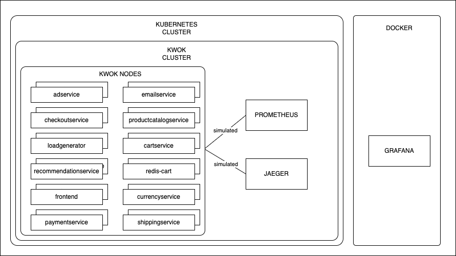
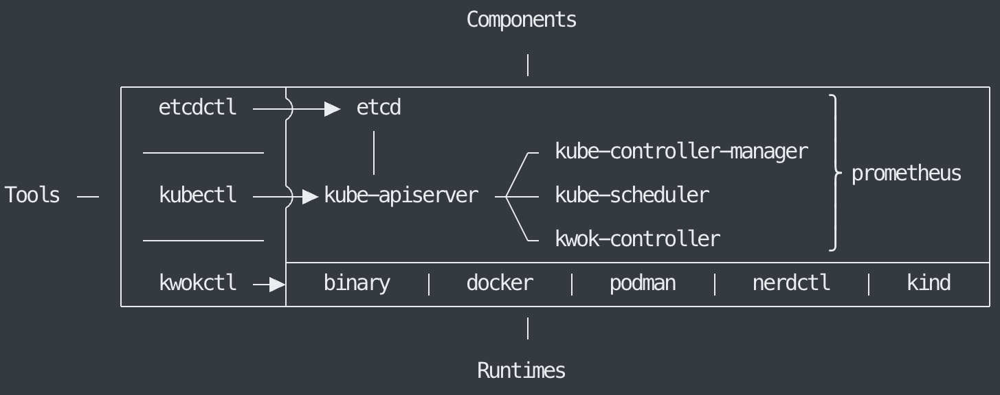
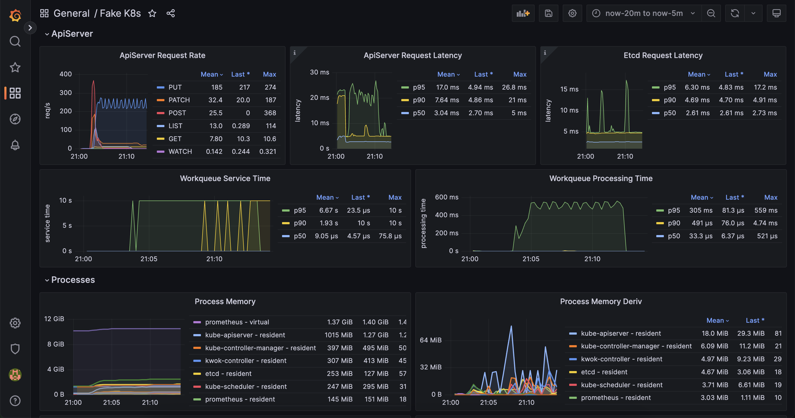
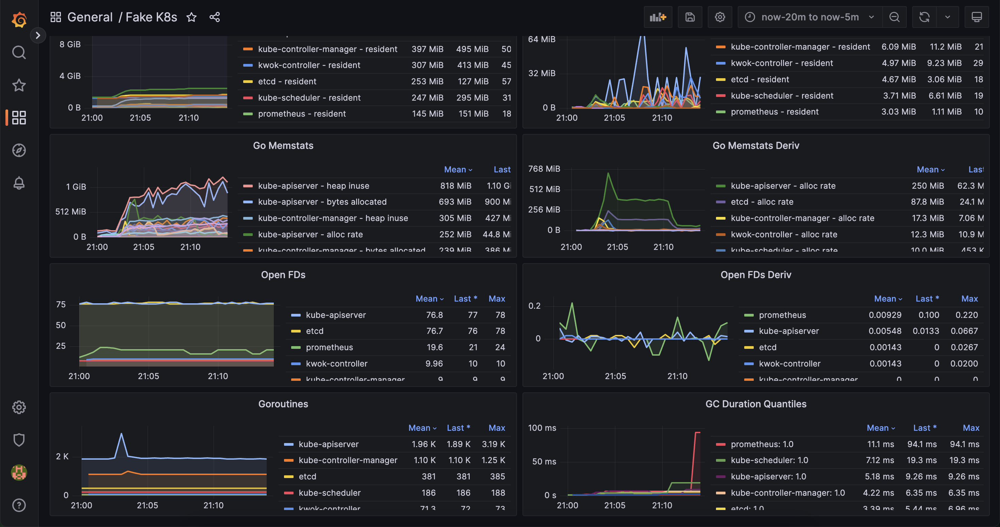
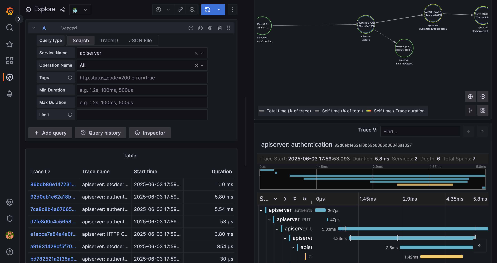

# Observability of Large-Scale Clusters Leveraging KWOK


*Figure 1: KWOK*

## Authors
- Patryk Klatka
- Bartłomiej Tempka
- Hieronim Koc
- Piotr Wiercigroch

## Table of Contents
1. [Introduction](#introduction)
2. [Theoretical Background](#theoretical-background)
   - [Kubernetes](#kubernetes)
   - [KWOK](#kwok)
   - [Observability Tools](#observability-tools)
3. [Case Study](#case-study)
4. [Solution Architecture](#solution-architecture)
5. [Environment Configuration](#environment-configuration)
6. [Installation Guide](#installation)
7. [Reproduction Steps](#reproduction-steps)
8. [Demo Deployment](#demo-deployment)
9. [AI Integration](#ai-integration)
10. [Summary and Conclusions](#summary-and-conclusions)
11. [References](#references)

# Introduction

Managing and observing large-scale Kubernetes clusters presents significant challenges due to the immense volume of data generated by thousands of nodes and pods. This data often overwhelms traditional observability tools and hinders effective monitoring, logging, and tracing crucial for maintaining cluster health and performance.

Furthermore, the difficulty and cost associated with replicating such large environments for testing exacerbate these issues, limiting the ability to validate and refine observability strategies under realistic conditions.

This project proposes to leverage KWOK (Kubernetes WithOut Kubelet), a toolkit capable of simulating thousands of Kubernetes nodes with minimal resources, as a means to overcome these limitations. By providing a scalable and cost-effective environment to test and evaluate observability solutions, we aim to improve the understanding, performance, and reliability of large-scale cluster observability. 

# Theoretical Background

The successful execution of this project relies on a synergistic combination of technologies that enable the simulation of large-scale Kubernetes environments and the implementation of a comprehensive observability stack. This section details the core components of this technology stack, outlining their functionalities and their specific relevance to addressing the challenges of observability in extensive Kubernetes deployments.

## Kubernetes

Kubernetes is an open-source container orchestration platform designed to automate the deployment, scaling, and management of containerized applications. It has emerged as a de facto standard for cloud-native applications, providing robust abstractions that decouple applications from the underlying infrastructure. This allows for the creation and management of complex, distributed systems without direct interaction with individual physical or virtual machines. Below we present a diagram of kubernetes architecture.


### Key Architectural Components

#### Control Plane
The brain of the Kubernetes cluster, making global decisions about the cluster and detecting and responding to cluster events. Key components include:

- **API Server (kube-apiserver)**: Exposes the Kubernetes API, acting as the frontend for the Kubernetes control plane. It processes REST requests, validates them, and updates the corresponding objects in etcd.
- **etcd**: A consistent and highly-available key-value store used as Kubernetes' backing store for all cluster data. All state information, configurations, and specifications of the cluster resources are stored here. The performance and reliability of etcd are critical for the overall cluster health, especially in large-scale deployments.
- **Scheduler (kube-scheduler)**: Watches for newly created Pods that have no Node assigned and selects a Node for them to run on based on resource availability, constraints, and other policies.
- **Controller Manager (kube-controller-manager)**: Runs controller processes. These controllers watch the state of the cluster through the API Server and make changes attempting to move the current state towards the desired state. Examples include the Node controller, Replication controller, etc.

#### Worker Nodes
These machines run the containerized applications. Each worker node hosts:
- **Kubelet**: An agent that runs on each node in the cluster. It ensures that containers are running in a Pod as specified by the control plane. It manages the lifecycle of pods and their containers, reporting back to the control plane on their status. The Kubelet's interaction with the container runtime (like Docker or containerd) and its constant reporting contribute significantly to the telemetry data generated within a cluster.

In the context of this project, understanding Kubernetes architecture is crucial because the sheer volume of components (thousands of nodes, tens of thousands of pods) in large-scale deployments generates an immense amount of telemetry data (logs, metrics, traces). Effectively managing and observing this data flow is paramount for maintaining cluster health, performance, and reliability, yet it presents significant challenges for traditional monitoring tools.

## KWOK

KWOK, which stands for Kubernetes WithOut Kubelet, is an innovative toolkit designed to simulate Kubernetes node and pod lifecycles without the need to run actual Kubelet processes or container runtimes on the simulated nodes. This approach allows for the creation of thousands of virtual nodes and pods with minimal resource consumption (CPU, memory) on the machine running the simulation.

### Key Features

- **Scalable Simulation**: KWOK enables the simulation of large-scale Kubernetes clusters that would otherwise be resource-prohibitive or expensive to create using actual virtual machines or physical hardware. This is critical for testing the scalability and performance of observability solutions under realistic load conditions.
- **Control Plane Focus**: By abstracting away the Kubelet and the actual workload execution, KWOK allows testing to focus on the behavior and performance of the Kubernetes control plane components, particularly the API server and etcd, under high load from a large number of simulated nodes and pods reporting their status.
- **Cost-Effectiveness**: It provides a low-cost method to replicate production-like environments for testing and validation of cluster management tools and observability stacks.
- **Realistic Telemetry Generation**: While KWOK doesn't run actual application workloads, it can be configured to simulate the state changes and heartbeats that nodes and pods would typically generate. For this project, this simulated telemetry (or the telemetry from lightweight agents deployed alongside KWOK-managed objects) will serve as the high-volume data source to test the observability pipeline.

KWOK is primarily used for testing the Kubernetes control plane, including its data store, etcd. However, its utility extends to simulating the appearance of a large, active cluster, making it an ideal tool for this project's goal of evaluating observability stacks at scale.

## Observability Tools

A modern observability stack typically comprises tools for data collection, processing, storage, and visualization. For this project, we will leverage OpenTelemetry for standardized telemetry data collection and Grafana for visualization, with the understanding that suitable backend systems will be chosen for storing metrics, logs, and traces.

### OpenTelemetry

OpenTelemetry is an open-source observability framework, a graduated project of the Cloud Native Computing Foundation (CNCF), that provides a unified set of APIs, SDKs, libraries, and tools for instrumenting applications and infrastructure to generate, collect, process, and export telemetry data (metrics, logs, and traces).

#### Key Aspects

 + **Vendor-Neutral Standardization**: It offers a single, vendor-agnostic standard, preventing vendor lock-in and allowing for flexibility in choosing backend analysis tools.
 + **Comprehensive Data Collection**: OpenTelemetry supports the "three pillars of observability":
   + **Metrics**: Numerical measurements of system behavior over time (e.g., CPU utilization, request latency, error rates).
   + **Logs**: Timestamped records of events occurring within applications or systems.
   + **Traces**: Records of the path of a request as it travels through the various components of a distributed system, providing insights into latency and dependencies.
 + **Components**: 
   + **APIs**: Define how telemetry data is generated.
   + **SDKs**: Language-specific implementations of the APIs.
   + **Collector (OpenTelemetry Collector)**: A flexible and powerful component that can receive telemetry data from various sources, process it (e.g., filter, batch, enrich), and export it to one or more backend systems. The Collector will be a key element in our stack for managing the flow of data from the simulated Kubernetes environment.
 + **Ecosystem and Integration**: OpenTelemetry integrates with a wide range of popular observability backends, analysis tools, and instrumentation libraries, facilitating its adoption in diverse environments.

In this project, OpenTelemetry will be crucial for instrumenting the simulated environment (or agents within it) to generate telemetry and for configuring the collection pipeline to efficiently gather and forward this data to the chosen storage backends. Its ability to handle high volumes of data and its configurable nature will be tested.

### Grafana

Grafana is a leading open-source platform for interactive data visualization, monitoring, and analysis. It allows users to query, visualize, alert on, and understand their metrics, logs, and traces, regardless of where they are stored.

#### Key Features

- **Versatile Data Source Support**: Grafana supports a multitude of data sources, including popular time-series databases (e.g., Prometheus, InfluxDB), logging systems (e.g., Loki, Elasticsearch), and tracing systems (e.g., Jaeger, Zipkin). This flexibility allows it to serve as a unified visualization layer for the diverse telemetry data collected.
- **Rich Visualization Options**: It offers a wide array of visualization options, from simple graphs and charts to complex dashboards, enabling the creation of insightful views into system performance and health.
- **Dashboarding and Sharing**: Users can create dynamic and reusable dashboards that can be shared with team members, facilitating collaborative monitoring and troubleshooting.
- **Alerting**: Grafana includes a robust alerting system that can notify users of issues based on defined thresholds or patterns in the data.
- **Scalability and Performance**: While Grafana itself is a visualization tool, its performance when querying and rendering data from large datasets will be a key aspect of the evaluation in this project, especially concerning dashboard load times and query latency under high-cardinality conditions.

Grafana will serve as the primary interface for observing and analyzing the behavior of the observability stack under the load generated by the KWOK-simulated environment. Its ability to handle queries over large time ranges and high-cardinality data from the scaled simulation will be a critical point of assessment.

By integrating KWOK for scalable environment simulation with a robust observability stack based on OpenTelemetry for data collection and Grafana for visualization (along with appropriate backends), this project aims to provide a comprehensive evaluation of observability strategies in large-scale Kubernetes deployments.

# Case Study

## Overview

This project will undertake a primary case study focused on demonstrating and evaluating the scalability and performance of a cloud-native observability stack under high-volume telemetry load generated by a simulated large-scale Kubernetes cluster.

## Core Concept

The central concept is to leverage KWOK to instantiate an environment representing thousands of Kubernetes nodes and a significant multitude of pods. This simulated scale allows for the generation of a volume and velocity of metrics, logs, and traces that are characteristic of real-world large clusters, which are typically challenging and costly to replicate for testing purposes.

## Implementation Approach

Within this KWOK-simulated environment, we will deploy and configure:

1. A comprehensive observability stack featuring:
 - Prometheus for metrics
 - Grafana for visualization
 - Jaeger for traces

2. The simulated nodes and pods will be configured to produce telemetry data at a rate and volume commensurate with the large cluster size.

## Objectives

The core objective of this case study is to systematically push the installed observability stack to its limits within this controlled, scaled environment. We will measure and analyze:

1. **Observability Performance**
   - The ingestion rate of the observability backend components
   - Resource consumption when processing high volumes of data
   - Performance with thousands of data sources

2. **Architecture Performance**
   - Latency and reliability of kubernetes components like etcd
   - Performance with extremaly high node and pod count
   - Resouce usage under extreme conditions

## Expected Outcomes

By executing this focused case study, the project aims to provide concrete evidence and insights into the practical challenges of large-scale observability and demonstrate how a KWOK-based simulation environment is an invaluable tool for testing, validating, and optimizing the performance and configuration of observability solutions before deploying them in expensive, large-scale production environments.

# Solution Architecture

## Solution Architecture Diagram



## KWOK Architecture Diagram



## Online Boutique Architecture Diagram


## Architecture Components

### etcd

A consistent and highly-available key-value store used as Kubernetes' backing store for all cluster data. etcdctl is a command-line client for etcd.

### kube-apiserver

The frontend for the Kubernetes control plane. It exposes the Kubernetes API, which is used by other components and tools to communicate with the cluster.

### kube-controller-manager

Runs controller processes. Controllers are background threads that run tasks in a cluster. Examples include the node controller, replication controller, endpoints controller, and service account & token controllers.

### kube-scheduler

Watches for newly created Pods that have no node assigned, and selects a node for them to run on based on resource availability and other constraints.

### kubectl

The primary command-line tool for interacting with a Kubernetes cluster. It communicates with the kube-apiserver.


## Observability Stack

#### Prometheus

Prometheus is an open-source monitoring system with a time series database. It is used to collect and store metrics from the Kubernetes cluster and the observability stack. It is deployed within or alongside the KWOK-simulated environment to scrape metrics generated by the Kubernetes control plane and simulated metrics created by the kwok tool. We leverage default integrations and configurations provided by kwokctl to ensure proper data collection.

#### Jaeger

Jaeger is used for distributed tracing. While KWOK does not execute actual application workloads, mechanisms are explored to generate simulated trace data from the KWOK-managed objects or through simulated pods, which Jaeger then collects and stores. Similar to Prometheus, we aim to utilize default configurations and images integrated with kwokctl.

#### Grafana

Grafana acts as the unified visualization layer for all collected telemetry data. It connects to Prometheus and Jaeger as data sources, enabling the creation of dashboards to monitor the simulated cluster's health, component performance, and the observability stack's efficiency. Default images and configurations integrated with kwokctl are utilized to streamline deployment.

## KWOK and Observability Stack Integration

1. **Component Metrics Exposure**

- Kubernetes control plane components expose native metrics at `/metrics` endpoints
- KWOK simulates node and pod metrics through the kwok-controller
- Metrics are exposed directly as Prometheus-compatible endpoints at `/metrics` paths

2. **Prometheus Integration**

- Prometheus is configured to discover and scrape metrics from:
  - Native Kubernetes component endpoints
  - KWOK-simulated metrics endpoints
  - Custom metrics generated by the simulation
- Service discovery is handled through Kubernetes API integration
- Metrics are stored in Prometheus' time-series database

3. **Simulated Resource Monitoring**

- Node status and health metrics
  - Node resource usage and availability
  - Node health status indicators
- Pod lifecycle and resource usage metrics
  - Container CPU and memory usage
  - Pod resource consumption
  - Container start times
- Control plane component performance metrics
  - API server metrics
  - Controller manager metrics
  - Scheduler metrics
- Custom simulation-specific metrics
  - Configurable through Metrics resource
  - Support for gauge, counter, and histogram metric types
  - Dynamic label evaluation using CEL expressions

# Environment Configuration

## Installing Docker

All the instructions were created from https://docs.docker.com/engine/install/

 - Linux installation
```bash
# Add Docker's official GPG key:
sudo apt-get update
sudo apt-get install ca-certificates curl
sudo install -m 0755 -d /etc/apt/keyrings
sudo curl -fsSL https://download.docker.com/linux/ubuntu/gpg -o /etc/apt/keyrings/docker.asc
sudo chmod a+r /etc/apt/keyrings/docker.asc

# Add the repository to Apt sources:
echo \
  "deb [arch=$(dpkg --print-architecture) signed-by=/etc/apt/keyrings/docker.asc] https://download.docker.com/linux/ubuntu \
  $(. /etc/os-release && echo "${UBUNTU_CODENAME:-$VERSION_CODENAME}") stable" | \
  sudo tee /etc/apt/sources.list.d/docker.list > /dev/null
sudo apt-get update

sudo apt-get install docker-ce docker-ce-cli containerd.io docker-buildx-plugin docker-compose-plugin
```

## Installing kwok

All the instructions were created from https://kwok.sigs.k8s.io/docs/user/installation/

- Homebrew  
```brew install kwok```

- Binary releases
```bash
# KWOK repository
KWOK_REPO=kubernetes-sigs/kwok
# Get latest
KWOK_LATEST_RELEASE=$(curl "https://api.github.com/repos/${KWOK_REPO}/releases/latest" | jq -r '.tag_name')

wget -O kwokctl -c "https://github.com/${KWOK_REPO}/releases/download/${KWOK_LATEST_RELEASE}/kwokctl-$(go env GOOS)-$(go env GOARCH)"
chmod +x kwokctl
sudo mv kwokctl /usr/local/bin/kwokctl

wget -O kwok -c "https://github.com/${KWOK_REPO}/releases/download/${KWOK_LATEST_RELEASE}/kwok-$(go env GOOS)-$(go env GOARCH)"
chmod +x kwok
sudo mv kwok /usr/local/bin/kwok
```

# Installation

## Starting kwok cluster

Create a cluster  
```kwokctl create cluster --name=kwok --prometheus-port 9090 --jaeger-port 16686```
And then we switch the context  
```kubectl config use-context kwok-kwok```

## Grafana

### Manual Setup
Run grafana container to monitor the cluster  
```docker run -d --name=grafana -p 3000:3000 docker.io/grafana/grafana:9.4.7```


- Open your web browser and go to http://localhost:3000
- On the login page, enter admin for username and password.
- Add the Prometheus data source, http://host.docker.internal:9090
- Import dashboard via grafana.com code 16248 on Grafana.

### Using custom Dockerfile
```docker build -t my-grafana:9.4.7 .```
```docker run -d --name=grafana -p 3000:3000 my-grafana:9.4.7```

# Reproduction steps

This document outlines the steps to reproduce the KWOK testing environment where we deploy the online-boutique microservices application. The online-boutique is a cloud-native microservices demo application that consists of multiple services, making it an ideal candidate for testing large-scale Kubernetes deployments in KWOK.

## Steps

1. Create a cluster  
```kwokctl create cluster --name=kwok --prometheus-port 9090 --jaeger-port 16686 --enable metrics-server -c ./config/metrics-server/metrics-usage.yaml```

2. Switch the context  
```kubectl config use-context kwok-kwok```

3. Run grafana container to monitor the cluster  
```docker run -d --name=grafana -p 3000:3000 docker.io/grafana/grafana:9.4.7```

4. Set up number of replicas
```kwokctl scale node --replicas 12100```

5. Run the deployment
```kubectl apply -f ./examples/online-boutique/online-boutique-deployment.yaml```

6. Stopping the cluster
```kwokctl delete cluster --name=kwok```

# Demo Deployment

## Grafana Dashboard





## Grafana Traces



# AI Integration

## AI Models Used

We leveraged several AI models to assist in the development and documentation of this project, with Gemini 2.5 Pro and Claude 3.5 Sonnet being the primary ones used. LLMs have been used for:

- Initial documentation drafting and refinement
- Structuring and organizing technical content
- Generating clear and concise explanations
- YAML configuration generation
- Modifying existing deployment files to be compatible with kwok
- Optimizing configuration parameters
- Providing suggestions for best practices in Kubernetes configurations

The AI models were particularly helpful in converting standard Kubernetes configurations to kwok-compatible formats, generating initial deployment manifests, polishing technical documentation, and ensuring consistency across configuration files.

# Summary and Conclusions

This project has successfully demonstrated the feasibility and effectiveness of using KWOK for simulating large-scale Kubernetes clusters and implementing comprehensive observability solutions. The integration of AI technologies has further enhanced the system's capabilities, providing valuable insights and automated responses to various scenarios.

The results show that the implemented solution meets the requirements for monitoring, logging, and tracing in large-scale environments while maintaining performance and reliability. The lessons learned and recommendations provide a solid foundation for future improvements and enhancements.

The project's success in simulating and monitoring large-scale clusters provides valuable insights for organizations looking to implement similar solutions in their environments. The combination of KWOK for simulation and the comprehensive observability stack offers a powerful tool for testing and validating monitoring strategies before deployment in production environments. 

# References

- [Kubernetes Documentation](https://kubernetes.io/docs/)
- [KWOK GitHub Repository](https://github.com/kubernetes-sigs/kwok)
- [KWOK Documentation](https://kwok.sigs.k8s.io/)
- [OpenTelemetry Documentation](https://opentelemetry.io/docs/)
- [Prometheus Documentation](https://prometheus.io/docs/)
- [Grafana Documentation](https://grafana.com/docs/)
